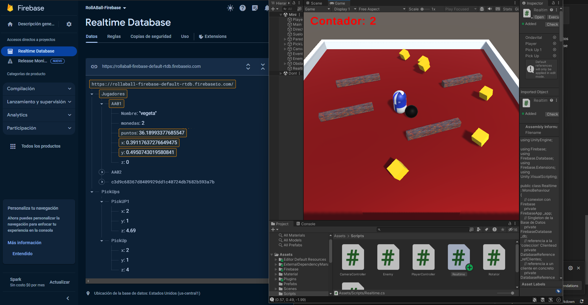

# Unity Firebase Realtime Database Integration

## Este proyecto demuestra cómo integrar Firebase Realtime Database en un juego Unity para crear una experiencia de juego en tiempo real. El código proporcionado muestra cómo conectar la base de datos, enviar y recibir datos, y actualizar objetos de juego en consecuencia.

### Estructura del Proyecto

Conexión con Firebase:

    La conexión con Firebase se establece al inicio del juego utilizando la instancia de FirebaseApp.

```csharp
// Start is called before the first frame update
void Start()
{
    // inicializamos contador
    _i = 0;
    
    // realizamos la conexión a Firebase
    _app = Conexion();
    
    // obtenemos el Singleton de la base de datos
    _db = FirebaseDatabase.DefaultInstance;
    
    // Definimos la referencia a Clientes
    _refClientes = _db.GetReference("Jugadores");
    
    // Definimos la referencia a AA02
    _refAA002 = _db.GetReference("Jugadores/AA02");
    
    // Recogemos todos los valores de Clientes
    _refClientes.GetValueAsync().ContinueWithOnMainThread(task => {
        if (task.IsFaulted) {
            // Manejar el error...
        }
        else if (task.IsCompleted) {
            DataSnapshot snapshot = task.Result;
            // Mostramos los datos
            RecorreResultado(snapshot);
        }
    });
    
    // Añadimos el evento de cambio de valor
    _refAA002.ValueChanged += HandleValueChanged;

    // Añadimos un nodo
    AltaDevice();

    DatabaseReference pickUpRef1 = _db.GetReference("PickUps/PickUP1");
    DatabaseReference pickUpRef = _db.GetReference("PickUps/PickUp");

    pickUpRef.ValueChanged += (sender, args) => HandleValueChanged(args.Snapshot, PickUp);
    pickUpRef1.ValueChanged += (sender, args) => HandleValueChanged(args.Snapshot, PickUp1);
}

```
Actualización en Tiempo Real:

    La posición del jugador se actualiza en la base de datos en cada cuadro.

```csharp
// Update is called once per frame
void Update()
{
    float playerX = player.transform.position.x;
    float playerY = player.transform.position.y;

    // Actualizo la base de datos en cada frame, ¡CUIDADO!
    _refClientes.Child("AA01").Child("puntos").SetValueAsync(_i);
    _i = _i + 0.01f;
    _refClientes.Child("AA01").Child("x").SetValueAsync(playerX);
    _refClientes.Child("AA01").Child("y").SetValueAsync(playerY);
}

```

Evento de Cambio de Valor:

    Se utiliza un evento para detectar cambios en los datos de la base de datos y actualizar objetos de juego en consecuencia.

```csharp

void HandleValueChanged(object sender, ValueChangedEventArgs args) {
    if (args.DatabaseError != null) {
        Debug.LogError(args.DatabaseError.Message);
        return;
    }
    // Mostramos los resultados
    MuestroJugador(args.Snapshot);
    // Escalo el objeto
    float escala = float.Parse(args.Snapshot.Child("puntos").Value.ToString());
    Vector3 cambioEscala = new Vector3(escala, escala, escala);
    ondavital.transform.localScale = cambioEscala;
}
```
Alta de un Nodo:

    Se añade un nodo con un identificador único.

```csharp
// Damos de alta un nodo con un identificador único
void AltaDevice()
{
    _refClientes.Child(SystemInfo.deviceUniqueIdentifier).Child("nombre").SetValueAsync("Mi dispositivo");
}
```
Funciones de Ayuda:
    
    Se incluyen funciones auxiliares para recorrer resultados y mostrar información del jugador.

```csharp
void RecorreResultado(DataSnapshot snapshot)
{
    foreach(var resultado in snapshot.Children) // Clientes
    {
        Debug.LogFormat("Key = {0}", resultado.Key);  // "Key = AAxx"
        foreach(var levels in resultado.Children)
        {
            Debug.LogFormat("(key){0}:(value){1}", levels.Key, levels.Value);
        }
    }
}

// Muestra la información de un jugador
void MuestroJugador(DataSnapshot jugador)
{
    foreach (var resultado in jugador.Children) // Jugador
    {
        Debug.LogFormat("{0}:{1}", resultado.Key, resultado.Value);
    }
}

```
Configuración:

    Clona o descarga el repositorio en tu máquina local.

Abre el proyecto en Unity.
Configura Firebase en el proyecto Unity siguiendo las instrucciones proporcionadas por Firebase.
Asegúrate de tener una base de datos Firebase configurada con la estructura adecuada.
Uso
Asegúrate de que la estructura de datos en tu base de datos Firebase coincida con la utilizada en el código.
Ejecuta el juego en Unity y observa cómo los objetos de juego se actualizan en tiempo real según los cambios en la base de datos.



>[!IMPORTANT]
> Podemos ver como se está cogiendo las posiciones de la pelota, así como también los `PickUps` están juntos en la imagen porque en el FireBase estámos poniendoles el mimso valor de X e Y. Podemos mover las monedas (PickUps) mientras jugamos y ponerlas en las coordenadas que queramos.