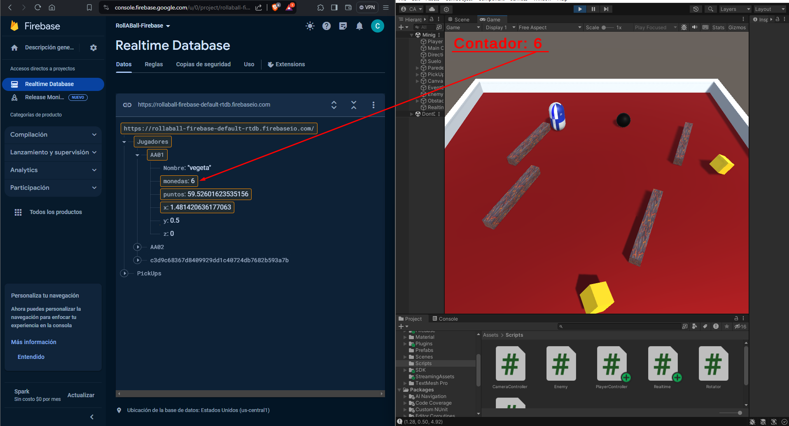
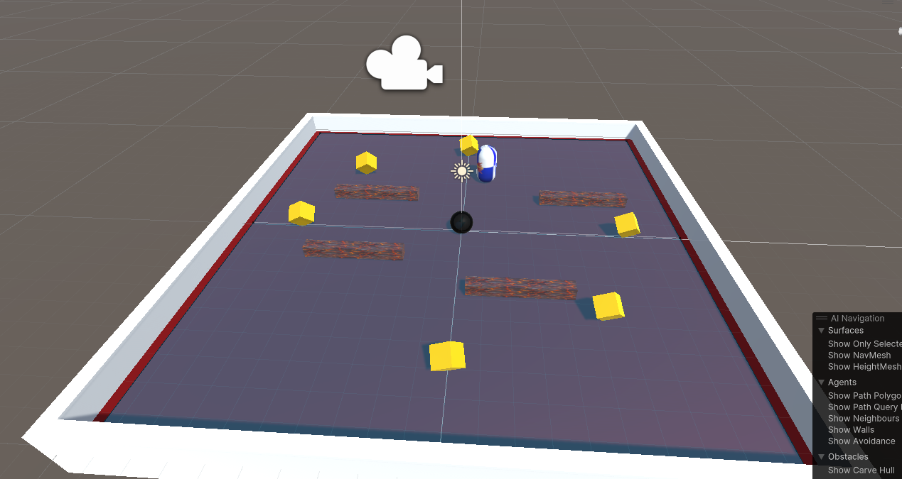
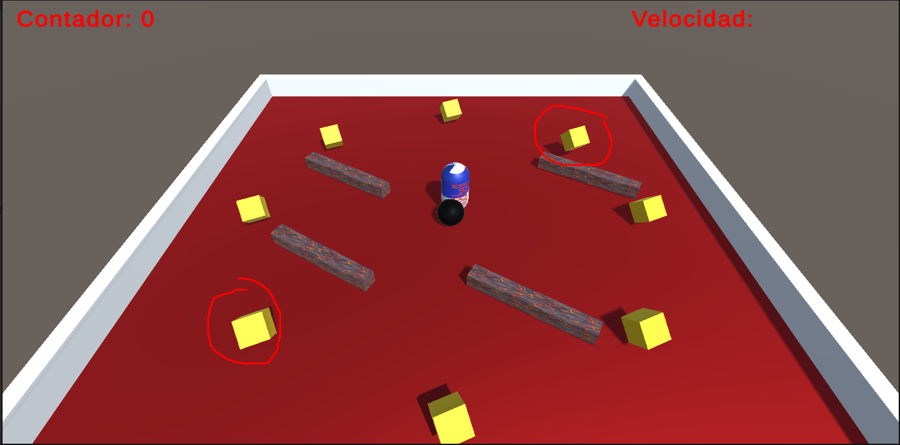
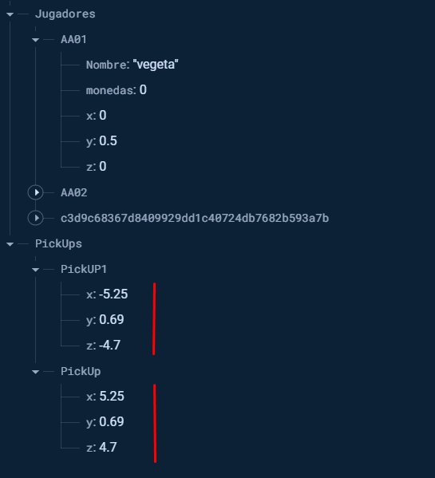

# Unity Firebase Realtime Database Integration

## Este proyecto demuestra cómo integrar Firebase Realtime Database en un juego Unity para crear una experiencia de juego en tiempo real. El código proporcionado muestra cómo conectar la base de datos, enviar y recibir datos, y actualizar objetos de juego en consecuencia.

---

## Conexión a Firebase

    Primero, el script establece una conexión a Firebase y configura las referencias necesarias para interactuar con la base de datos en tiempo real.

```csharp
// Conexión con Firebase
private FirebaseApp _app;
// Singleton de la Base de Datos
private FirebaseDatabase _db;
// Referencia a la 'colección' Clientes
private DatabaseReference _refClientes;
// Referencia a un cliente en concreto
private DatabaseReference _refAA002;
```

### La función `Conexion()` se encarga de verificar las dependencias de Firebase y crear una instancia de FirebaseApp, que es necesaria para el acceso y la manipulación de la base de datos.

```csharp
FirebaseApp Conexion()
{
    FirebaseApp firebaseApp = null;
    FirebaseApp.CheckAndFixDependenciesAsync().ContinueWithOnMainThread(task =>
    {
        var dependencyStatus = task.Result;
        if (dependencyStatus == DependencyStatus.Available)
        {
            firebaseApp = FirebaseApp.DefaultInstance;
        }
        else
        {
            Debug.LogError(System.String.Format(
                "Could not resolve all Firebase dependencies: {0}", dependencyStatus));
            firebaseApp = null;
        }
    });
    return firebaseApp;
}
```

## Inicialización y Escucha de Cambios
### En el método `Start()`, se inicializan las referencias a la base de datos y se configuran listeners para escuchar cambios en tiempo real en las posiciones de objetos (PickUps) y datos de jugadores.

```csharp
void Start()
{
    _app = Conexion();
    _db = FirebaseDatabase.DefaultInstance;
    _refClientes = _db.GetReference("Jugadores");
    _refAA002 = _db.GetReference("Jugadores/AA02");

    // Otras configuraciones y listeners...
}
```

## Actualización de Datos en Tiempo Real
### El código utiliza eventos para manejar cambios en la base de datos, como la posición de objetos en el juego o la información de los jugadores. Por ejemplo, el método HandleValueChanged actualiza la posición de un objeto (PickUp) en el juego cuando se detecta un cambio en su posición en la base de datos.

```csharp
void HandleValueChanged(DataSnapshot snapshot, GameObject pickUpObject)
{
    float pickUpX = float.Parse(snapshot.Child("x").Value.ToString());
    float pickUpY = float.Parse(snapshot.Child("y").Value.ToString());
    float pickUpZ = float.Parse(snapshot.Child("z").Value.ToString());

    Vector3 newPosition = new Vector3(pickUpX, pickUpY, pickUpZ);
    pickUpObject.transform.position = newPosition;
}
```

## Actualización de Datos del Jugador
### Finalmente, el método Update() se ejecuta una vez por cada frame y se utiliza para actualizar la posición del jugador y su conteo de monedas en la base de datos en tiempo real.

```csharp
void Update()
{
    float playerX = player.transform.position.x;
    float playerY = player.transform.position.y;
    _refClientes.Child("AA01").Child("x").SetValueAsync(playerX);
    _refClientes.Child("AA01").Child("y").SetValueAsync(playerY);

    int monedas = playerController.ObtenerContador();
    _refClientes.Child("AA01").Child("monedas").SetValueAsync(monedas);
}
```
---

## Veamos como se ve FireBase y Unity


> [!NOTE]
>Aqui podemos ver como se recoger en nuestra base de datos los valores de las monedas que vamos recogiendo en nuestro Roll-A-Ball



> [!NOTE]
>Aqui podemos ver como antes de iniciar el juego nos faltan dos monedas, las cuales aparecerán una vez se ejecute este mismo



> [!NOTE]
>Una vez ya ejecutado el programa, nos aparecen estas 2 monedas que se rodean



> [!NOTE]
>Aqui podemos ver como les damos los valores a las monedas, además en el caso de que una vez está ejecutado el juego les cambiemos algún valor, estas cambiaran de posición automaticamente en nuestro Roll-A-Ball
